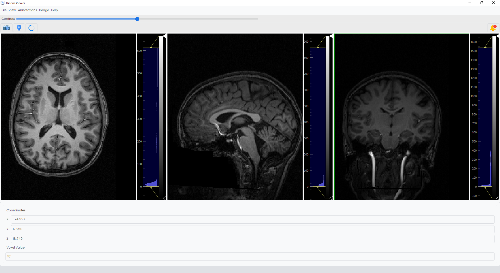

# DICOM Viewer



[](https://opensource.org/licenses/MIT)
[](https://www.python.org/downloads/)
[](https://pypi.org/project/PyQt5/)

## Table of Contents
- [Description](#description)
- [Features](#features)
- [How to Run It?](#how-to-run-it)
- [Toolstack](#toolstack)
- [Areas of Improvement](#areas-of-improvement)
- [Contributors](#contributors)
- [License](#license)


## Description
## Features


## How to Run It?

To be able to use our app, you can simply follow these steps:
1. Install Python3 on your device. You can download it from <a href="https://www.python.org/downloads/">Here</a>.
2. Install the required packages by the following command.
```
pip install -r requirements.txt
```
3. Run the file with the name "main.py" located in the root.

> [!CAUTION]
> If you have Python 12+, the qDarkTheme package won't work. You must comment on out its import in the `main.py` and the line that calls it and sets up the theme.

## Contributors

Gratitude goes out to all team members for their valuable contributions to this project.

<div align="center">

| <a href="https://github.com/cln-Kafka"></a> | <a href="https://github.com/MuhammadSamiAhmad"></a> | <a href="https://github.com/hagersamir"></a> | <a href="https://github.com/mohandemadx"></a> | <a href="https://github.com/JasmineTJ"></a> | <a href="https://github.com/Salma-me"></a> | <a href="https://github.com/Sarah2332"></a> |
| :-: | :-: | :-: | :-: | :-: | :-: | :-: |
| [Kareem Noureddine](https://github.com/cln-Kafka) | [Mohamed Sami](https://github.com/MuhammadSamiAhmad) | [Hager Samir](https://github.com/hagersamir) | [Mohaned Emad](https://github.com/mohandemadx) | [Yassmeen Al-Jammal](https://github.com/JasmineTJ) | [Salma Ashraf](https://github.com/Salma-me) | [Sara Mohamed](https://github.com/Sarah2332) |

</div>

## License

This project is licensed under the MIT License. See the [LICENSE](./LICENSE) file for more details.
